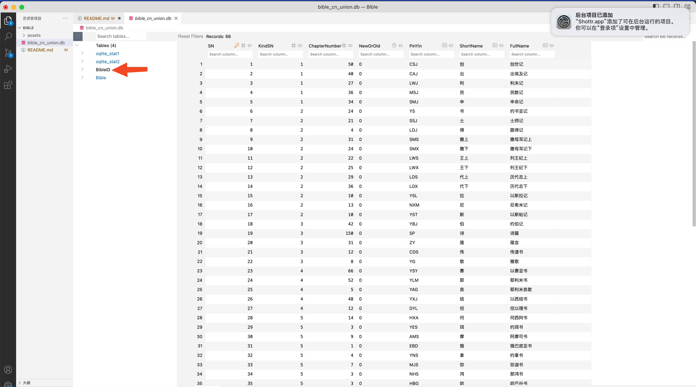
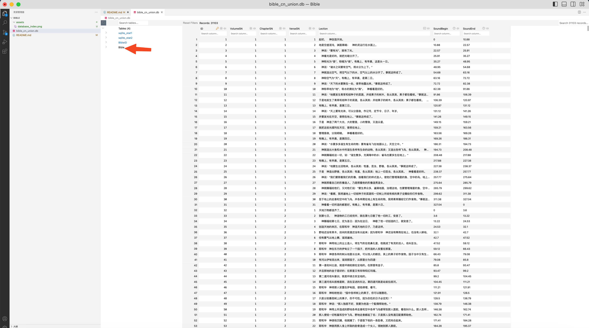

# Bible iOS Project

一个圣经App, Objc 编码

## Plan

1. 基本的经文导航，阅读，搜索功能
2. 个人的经文笔记，导入导出，分享
3. 感想Feed，内部发文
4. 添加博客、sptify链接🔗

## Details

1. 数据库选用Sqlite, 框架使用[WCDB](https://github.com/Tencent/wcdb/wiki)
2. 经文数据库来自于: https://github.com/xieyao04/bible 中文和合本
3. icon来自于: https://fonts.google.com/icons?hl=zh-cn&icon.platform=web&icon.query=feed

## DataBase

数据库结构(用vscode sqlite viewer 插件看一下)
1. 索引表
2. 内容表

</img>
</img>

## Developer Guide

暂时没有太多规范，一般小驼峰编码就行，尽可能解耦，充分注释，命名明确，定义类保持单一的指责

## Milestone
* 2023/5/13: init project

## Reference
1. 一个开源Android圣经阅读App https://andbible.github.io/, [github](https://github.com/AndBible/and-bible)
2. A collection of freely licensed translations of biblical text in OSIS format. [github](https://github.com/gratis-bible/bible)
3. A RESTful API for Bible [github](https://github.com/omarciovsena/abibliadigital)
