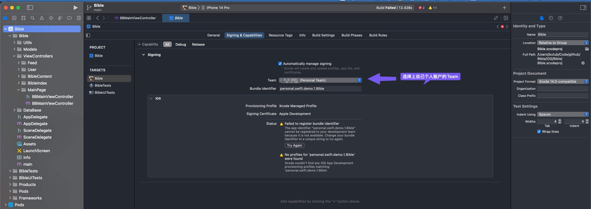

# START

> 总共6个步骤

## 1. 环境配置

准备开发环境：需要安装 Xcode 开发工具和 CocoaPods 依赖管理工具。

* [Xcode](https://developer.apple.com/xcode/): 是苹果官方的开发工具，用来开发iOS、iPad、Mac上的App，是比不可少的，提供开发需要的SDK，模拟器等内容。
* [CocoaPods(意思是可可豆)](https://cocoapods.org/): 是第三方库管理工具，第三方库，或者工程需要的其他的动态库、静态库、源码组件，都被称作依赖。

xcode在应用商店安装就行, 版本暂时不做限制，最新稳定版本14.2，或者更高，基本不会有问题。


然后根据Cocopods[官网](https://cocoapods.org/)的指导，安装cocoapods
```sh
 sudo gem install cocoapods
```

## 2. 克隆代码
这里暂时认为大家比较熟悉git操作，如果还比较不熟悉，可以看[pro git](https://www.progit.cn/#_git_%E5%9F%BA%E7%A1%80) 了解版本控制系统，或者其他的相关材料。

代码仓库，也就是本仓库: `https://github.com/Bible0x1/Bible`

`Bible0x1`是组织名字，Organization，是github提供的一个多人协同的工作区。

clone推荐使用ssh的方式


## 3. 安装依赖库

使用 CocoaPods 安装项目中所需的第三方库。

依赖是在`Podfile`文件中申明

```sh
.
├── Bible
├── Bible.xcodeproj
├── Bible.xcworkspace
├── BibleTests
├── BibleUITests
├── Podfile <------ 这个
└── Podfile.lock
```
内容是:

```ruby
# Uncomment the next line to define a global platform for your project
platform :ios, '13.0'

target 'Bible' do
  # Comment the next line if you don't want to use dynamic frameworks
  use_frameworks!

  # Pods for Bible
  pod 'AFNetworking', '~> 3.0' # 网络库
  pod 'WCDB.objc'               # 数据库框架
  pod 'Masonry'                # 布局框架
  pod 'LookinServer', :configurations => ['Debug'] # 布局排查工具
  target 'BibleTests' do
    inherit! :search_paths
    # Pods for testing
  end

  target 'BibleUITests' do
    # Pods for testing
  end
end

```

运行命令, 安装依赖:

```sh
pod install
```
应当有如下输出


并且会自动生成`Bible.xcworkspace`工程文件

## 4.打开工程文件：

一般`Xcode`默认的是`*.xcodeproj`

我们这里使用Cocoapods生成了另一个`*.xcworkspace`文件。

打开它:

```sh
open open Bible.xcworkspace
```

预期会是这样:


如果打开不一样，那么应该是xcode版本不对，需要更新到14.2或者更高, 可以下载一个[xcodes](https://github.com/XcodesOrg/XcodesApp)来进行多xcode版本管理。


xcodes中下载需要的版本:


⚠️ 注意：有可能也会需要更新`Mac OS`的版本，这也是正常情况，`iOS`开发的生态是如此，受制于苹果的生态。


## 5. 配置证书和配置文件

需要为应用程序签名, 不然第一次编译，会有如下的错误


选择上自己的账户:




## 6. 编译并运行

使用 Xcode 的「Product」菜单中的「Run」命令编译并运行应用程序。


模拟器上，跑起来是这样的:


## 疑难杂症

### 1. 本地多ssh账户

错误提示：

```sh
(base) ➜  Bible git:(main) git push origin main
ERROR: Permission to Bible0x1/Bible.git denied to xxx.
致命错误：无法读取远程仓库。
```
记得加入到Identity中

```sh
(base) ➜  Bible git:(main) ssh-add   ~/.ssh/id_ed25519_swish0x7
Identity added: /Users/butub/.ssh/id_ed25519_swish0x7 (swish0x7@gmail.com)
```
